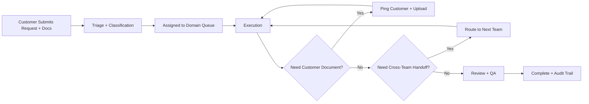

# BluBook Product Spec (One-Page)

## 1) Package Catalog

| Package              | Primary Buyer Need                   | Included Teams                                      | Typical Inputs                                                | Main Deliverables                                     | SLA Target                          |
| -------------------- | ------------------------------------ | --------------------------------------------------- | ------------------------------------------------------------- | ----------------------------------------------------- | ----------------------------------- |
| Finance Core         | Monthly bookkeeping and controls     | Finance                                             | Bank statements, invoices, payroll exports                    | Monthly close, reconciliations, P&L snapshot          | Close by business day 5             |
| Sales Ops Engine     | Order-to-cash execution              | Sales Ops, Finance                                  | Purchase orders, price lists, customer master                 | Order validation, invoicing handoff, status updates   | First response < 4h                 |
| Marketing Growth     | Campaign operations                  | Marketing                                           | Brand assets, campaign brief, audience list                   | Content calendar, campaign launch, performance report | Launch in 5 business days           |
| Legal and Compliance | Contract and policy coverage         | Legal                                               | Contract templates, partner/vendor docs, compliance checklist | Reviewed contracts, filing calendar, compliance log   | Review turnaround < 3 business days |
| HR Operations        | Workforce admin and policy execution | HR, Legal                                           | Employee roster, payroll files, policy docs                   | Payroll support, onboarding docs, policy attestations | Payroll cycle 100% on time          |
| Logistics Control    | Fulfillment and shipment tracking    | Logistics, Sales Ops                                | SKU list, warehouse map, shipping docs                        | Dispatch milestones, POD capture, exception handling  | Dispatch within agreed cut-off      |
| Corporate Suite      | Multi-function managed operations    | Finance, Sales Ops, Marketing, Legal, HR, Logistics | Full onboarding profile + package documents                   | Unified workflow dashboard and cross-team execution   | Cross-team SLA governance monthly   |

Notes:

- Buying a package means buying a predefined workflow set, not only a service label.
- Corporate Suite bundles multiple package workflows under one customer timeline.

## 2) Onboarding to Routing Rules

### Trigger Point

- Package matching happens immediately after checkout and before first live request execution.

### Required Onboarding Fields

- Business model: manufacturer, reseller, distributor, service provider.
- Industry: retail, beauty, food, industrial, SaaS, etc.
- Order complexity: low, medium, high.
- Inventory handling: in-house, third-party warehouse, no inventory.
- Regions served: domestic, cross-border.
- Compliance profile: tax/legal/privacy requirements.
- Existing systems: ERP, CRM, accounting, fulfillment stack.

### Rules Engine Logic (v1)

- If order complexity is medium/high, enable Sales Ops Engine workflow.
- If inventory handling is in-house or 3PL, enable Logistics Control branch.
- If monthly books are unmanaged, enable Finance Core with monthly close cadence.
- If workforce size > threshold, enable HR Operations branch.
- If regulated vertical or cross-border operations, enable Legal and Compliance branch.
- If customer buys Corporate Suite, auto-enable all baseline workflows and route by request type.

### Document Request Loop

- Workflow stage can raise Required Document events.
- Customer receives ping with exact document request and due date.
- Upload confirms receipt, unlocks blocked step, and notifies assigned partner queue.

## 3) End-to-End Workflow State Machine

### Canonical States

- `draft` -> `submitted` -> `triaged` -> `assigned` -> `in_progress` -> `waiting_for_customer` -> `review` -> `completed`
- Exception states: `on_hold`, `cancelled`, `rejected`, `sla_breached`.

### Routing by Request Type

- Sales Ops request: triage -> Sales Ops queue.
- Finance request: triage -> Finance queue.
- Legal request: triage -> Legal queue.
- HR request: triage -> HR queue.
- Logistics request: triage -> Logistics queue.
- Composite request: split into linked sub-work items per team.

### Hat Seller Example

1. Customer submits PO request from portal.
2. System classifies as Sales Ops and assigns queue owner.
3. Sales Ops validates order and requests missing docs if needed.
4. If storage/dispatch needed, auto-handoff to Logistics.
5. Logistics updates shipment milestones and uploads POD.
6. Finance receives completion signal and issues invoice/posting.
7. Request moves to review and closes as completed.

## 4) KPI and AI Alert Definitions

### Core KPI Set (Monthly)

- Intake to first response time.
- Stage cycle time by team.
- End-to-end completion time by package.
- SLA attainment rate and breach count.
- Rework rate (returned to previous stage).
- Waiting-on-customer time vs waiting-on-partner time.
- Document turnaround time.
- Partner utilization and backlog aging.
- Completion quality score (QA pass rate).
- Customer satisfaction (CSAT) at request close.

### Dashboard Cuts

- By package, by partner, by team, by customer segment, by month.
- Trend lines: current month vs prior 3 months.
- Breach drill-down: top causes and owners.

### AI Alerting (Sales and Ops)

- SLA risk alert: predicts breach before due time based on queue load and dwell time.
- Stuck workflow alert: no state movement beyond threshold.
- Missing doc alert: reminder cadence with escalation path.
- Handoff risk alert: sub-work item dependency likely to miss ETA.
- Capacity alert: partner queue saturation and reroute suggestion.
- Revenue leakage alert: delivered but uninvoiced, or invoiced but unreconciled.

### Suggested Initial Thresholds (v1)

- First response breach risk at 70% of SLA window consumed with no owner action.
- Stuck stage if no update for 24h (high priority) or 72h (normal priority).
- Escalate missing docs after 2 reminders or 48h overdue.
- Trigger capacity alert when queue utilization exceeds 85% for 2 consecutive days.

## Target Business Examples

- Hats distributor (existing target): needs Sales Ops, Logistics, Finance, HR baseline support.
- Boutique skincare brand: needs Marketing, Sales Ops, Finance, Legal compliance for packaging/claims.
- Industrial parts distributor: needs high-volume Sales Ops, Logistics milestones, Finance reconciliation, compliance documentation.
