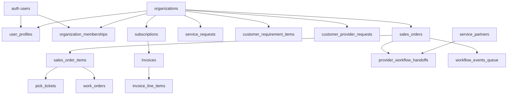

# Blubook Overview

## Scope and Method

This document is a deep technical overview of the **non-ignored repository codebase**.

What was included:

- Root architecture and workflow docs
- Next.js app routes and API handlers
- Workflow engines and state logic
- Services, hooks, stores, and supporting libraries
- Database-facing behavior inferred from API code and workflow code
- Scripts and test coverage

What was intentionally excluded from this document:

- Any `.gitignore`-ignored paths (for example build artifacts, local env files, dependencies)
- Sensitive credential values

---

## 1. System Snapshot

### Product shape

Blubook is a multi-role operations platform with dedicated role experiences:

- Customer
- Partner
- Staff
- Admin
- Sales
- Logistics

### Runtime stack

- Next.js 15 App Router
- React 19 + TypeScript strict mode
- Supabase (Auth, Postgres, Storage, Realtime)
- React Query for server-state caching
- Zustand for local UI and journey state
- Tailwind CSS design system + custom shell components
- Playwright E2E tests

### Architecture style

- Database-centered workflow and business state
- Route handlers implement role checks and orchestration
- Workflow event queue (`workflow_events_queue`) coordinates sales/logistics transitions
- Email delivery is queued and dispatched via API/system endpoint

---

## 2. Repository Structure (Functional Domains)

High-level source distribution (non-ignored files counted):

- `src/app`: 82 files
- `src/components`: 11 files
- `src/features`: 24 files
- `src/lib`: 14 files
- `src/services`: 6 files
- `src/store`: 5 files
- `src/hooks`: 3 files
- `tests/e2e`: 6 files
- `scripts`: 12 files
- `docs`: 4 files

### Root docs that drive implementation direction

- `README.md`: product and route-level orientation
- `RULES.md`: database-first constraints and guardrails
- `PHASES.md`: phased delivery model
- `IMPLEMENTATION_PHASES.md`: detailed phase execution and AI rollout intent
- `SALES_WORKFLOW_MANAGEMENT.md`: sales workflow narrative
- `LOGISTICS_WORKFLOW_MANAGEMENT.md`: logistics workflow narrative
- `WORKFLOW_INTERACTIONS.md`: handoff model between sales and logistics
- `AI_WORKFLOW_SERVICES.md`: AI service intent and governance boundaries

---

## 3. Configuration and Runtime Contracts

### App and toolchain configs

- `package.json`: scripts/deps
- `next.config.ts`: Next config
- `tsconfig.json`: strict TS config
- `tailwind.config.ts`: Tailwind config
- `eslint.config.mjs`: lint configuration
- `postcss.config.mjs`: PostCSS config
- `playwright.config.ts`: E2E runtime config

### Environment validation and requirements

`src/lib/env.ts` enforces key env categories:

- Public Supabase keys required for app runtime
- Service role required for onboarding server operations
- Resend credentials required for email pipeline

### Supabase client boundaries

- `src/lib/supabase/browser.ts`: browser client
- `src/lib/supabase/server.ts`: server client with cookie handling
- `src/lib/supabase/admin.ts`: service-role client for privileged operations
- `src/lib/supabase/middleware.ts`: session update and route gating logic

---

## 4. Authentication, Session, and Access Model

## Middleware path

- Root `middleware.ts` delegates to `updateSession` and skips static/framework/API asset paths.
- `src/middleware.ts` re-exports root middleware.

### Public route allowlist

In `src/lib/supabase/middleware.ts`, public routes include:

- `/`
- `/onboarding`
- `/login`
- `/register`
- `/forgot-password`
- `/reset-password`
- `/invite`
- `/verify-email`
- role roots (`/partner`, `/staff`, `/admin`, `/sales`, `/logistics`)

### Important auth behavior

- Non-public routes redirect to `/login?next=...` if no user session.
- In non-production, `NEXT_PUBLIC_DEV_AUTH_BYPASS` can bypass strict auth unless explicitly set to `false`.
- If Supabase env is missing in production-like context, middleware fails safe by redirecting protected paths to login.

### Role mapping

`src/types/domain.ts` currently defines user role union as:

- `customer`
- `partner`
- `staff`
- `admin`

There are additional role checks in APIs for `logistics` and `sales`-adjacent behavior, so role usage extends beyond the domain type union in some paths.

---

## 5. Frontend Route Map (App Router)

### Public / Auth pages

- `/` -> landing page (`src/app/page.tsx`)
- `/login`
- `/register`
- `/forgot-password`
- `/reset-password`
- `/invite`
- `/verify-email`
- `/onboarding`

### Customer pages

- `/customer/dashboard`
- `/customer/onboarding`
- `/customer/billing`
- `/customer/orders`
- `/customer/requests`
- `/customer/requests/[id]`
- `/customer/messages`
- `/customer/documents`
- `/customer/analytics`
- `/customer/settings`

### Partner pages

- `/partner/dashboard`
- `/partner/dashboard/[requestId]`
- `/partner/work-orders`
- `/partner/messages`
- `/partner/documents`
- `/partner/reports`

### Sales pages

- `/sales/orders`
- `/sales/work-orders`
- `/sales/invoices`
- `/sales/inventory`

### Logistics pages

- `/logistics/shipments`
- `/logistics/carriers`
- `/logistics/tracking`
- `/logistics/delivery`

### Admin pages

- `/admin/dashboard`
- `/admin/users`
- `/admin/roles`
- `/admin/settings`
- `/admin/audit-logs`
- `/admin/workflows`

### Staff pages

- `/staff/dashboard`

---

## 6. Layout, Shell, Navigation, and UI Composition

### Root composition

- `src/app/layout.tsx` applies fonts, providers, and debug component.
- `src/components/providers/app-providers.tsx` wraps app in React Query `QueryClientProvider`.

### Shell system

`src/components/shell/app-shell.tsx` centralizes:

- Sidebar navigation
- Global search input shell
- Notification bell and panel behavior
- Per-role nav badge counters
- Auth sign-out action via `useAuth`

### Role nav configuration

`src/features/navigation/role-nav.ts` defines nav trees for:

- customer
- partner
- staff
- admin

### Shared UI primitives

`src/components/ui/` includes reusable building blocks:

- button, input, card, badge, file-uploader

### Placeholder/scaffold utility

- `src/components/scaffold/placeholder-page.tsx` used in staged rollout sections

---

## 7. API Inventory (Method + Purpose)

## Admin APIs

- `GET /api/admin/ai-workflow`
  - Admin/staff guard
  - Returns workflow queue/handoff/logistics readiness counters
- `GET /api/admin/service-partners`
  - Admin/staff guard
  - Returns stream list + active partner roster
- `POST /api/admin/service-partners`
  - Admin/staff guard + zod payload
  - Creates service partner
- `PATCH /api/admin/service-partners/[id]`
  - Admin/staff guard + zod payload
  - Updates partner stream/name/site/active
- `DELETE /api/admin/service-partners/[id]`
  - Admin/staff guard
  - Soft-delete style via `is_active=false`

## Auth APIs

- `GET /api/auth`
  - Scaffold response only
- `GET /api/auth/context`
  - Resolves current user + org + role via profile/membership
- `POST /api/auth/customer-account`
  - Full onboarding account creation pipeline
- `POST /api/auth/invitations/send`
  - Admin/staff invite flow for partner/admin users
- `POST /api/auth/invitations/accept`
  - Tokenized invite acceptance and user activation

## Customer APIs

- `GET /api/customer/billing`
  - Returns current subscription + invoices
- `POST /api/customer/billing`
  - Cancel-at-period-end or package upgrade
- `GET /api/customer/orders`
  - Customer order list with timeline/delivery metadata extraction
- `GET /api/customer/provider-readiness`
  - Aggregates provider/requirement/SLA readiness metrics
- `GET /api/customer/requirements`
  - Returns requirement checklist for authorized org context
- `POST /api/customer/workflow/ensure-po-requirement`
  - Non-prod helper to ensure PO requirement exists for E2E kickoff
- `POST /api/customer/workflow/po-uploaded`
  - Converts PO evidence event into sales order + workflow kickoff

## Partner APIs

- `GET /api/partner/dashboard`
  - Partner-scoped provider request intelligence + required docs + AI readiness rollup
- `POST /api/partner/dashboard`
  - Partner accept/reject decisions on provider requests; creates notifications/messages
- `GET /api/partner/work-orders`
  - Lists inbound provider handoffs for mapped partner
- `POST /api/partner/work-orders`
  - Supports handoff actions: accept/reject/start/complete
  - On complete, validates required docs and queues delivery workflow event

## Logistics / Orders / Requests / Messages / Documents (mixed maturity)

- `GET /api/shipments`
  - Logistics/admin/staff guard; returns order rows in logistics statuses
- `POST /api/shipments`
  - Validated logistics status transition actions
- `GET /api/orders`
  - Scaffold response
- `GET /api/requests`
  - Scaffold response
- `GET /api/messages`
  - Scaffold response
- `GET /api/documents`
  - Scaffold response

## System APIs

- `POST /api/system/workflow/dispatch`
  - Admin/staff guard; runs workflow queue processor batch
- `GET /api/system/workflow/demo-order`
  - Usage hint
- `POST /api/system/workflow/demo-order`
  - Creates demo order, items, queue event, drains workflow queue
- `GET /api/system/workflow/orders`
  - Admin/staff guard; list orders or single order details
- `POST /api/system/emails/dispatch`
  - Admin/staff guard; drains outbound email queue

---

## 8. Deep Business Logic by Domain

## 8.1 Customer account creation and onboarding orchestration

`POST /api/auth/customer-account` is one of the densest paths:

Sequence:

1. Validate payload with zod (identity + onboarding fields)
2. Create Supabase auth user (email confirmed)
3. Resolve package (`service_packages`)
4. Create `organizations` row (`kind=customer`)
5. Create `user_profiles` and `organization_memberships`
6. Persist `customer_onboarding_submissions`
7. Run onboarding AI automation scorer
8. Create `subscriptions`
9. Create invoice + invoice line item
10. Execute RPCs:

- `sync_customer_requirements`
- `sync_customer_provider_requests`
- `refresh_customer_sla_activation`

11. Queue onboarding-complete email + attempt dispatch
12. Return identity/subscription/invoice references

Rollback signal:

- If later-stage failures occur, created auth user is deleted.

## 8.2 Invitation lifecycle

Invite send (`/api/auth/invitations/send`):

- Creates organization + membership (invited)
- Generates random token and stores only SHA256 hash
- Stores pending invitation + expiry
- Queues invite email

Invite accept (`/api/auth/invitations/accept`):

- Validates token hash, email match, status, expiry
- Creates auth user
- Upserts user profile
- Activates membership and invitation

## 8.3 Customer billing operations

`/api/customer/billing`:

- GET surfaces current subscription + package metadata + invoice list
- POST supports `cancel` and `upgrade`
- Upgrade rewrites subscription package/billing fields to selected package

## 8.4 Customer requirements and PO workflow kick-off

`/api/customer/requirements` ensures caller belongs to requested org via profile/membership checks.

`/api/customer/workflow/po-uploaded`:

- Confirms requirement belongs to caller org
- Ensures requirement is a purchase-order type
- Creates/uses sales order
- Creates fallback sales order item for stream
- Queues `order.created` event (dedup check)
- Drains workflow queue in bounded loops

`/api/customer/workflow/ensure-po-requirement` (dev/test helper):

- Non-production only
- Ensures a PO requirement exists and resets status for E2E runs
- Injects preferred mock partner emails for deterministic partner mapping in tests

## 8.5 Partner dashboard intelligence and decisioning

`/api/partner/dashboard`:

- Resolves partner identity to `service_partner_id` via multiple fallbacks:
  - profile metadata
  - user metadata
  - membership metadata
  - org metadata
  - mock account lookup by user/email/org
- Loads provider requests assigned to partner
- Joins customer requirement completion/evidence
- Creates signed URLs for requirement evidence files
- Blends AI priority scores and confidence into readiness assessment
- Returns request-level and summary-level readiness state

Decision POST:

- Accept/reject provider request
- Writes notifications to customer users
- Writes request messages into linked service request threads

## 8.6 Partner work-order lifecycle

`/api/partner/work-orders` supports actions:

- accept
- reject
- start
- complete

On complete:

- Validates required documents are uploaded (matching required document keys)
- Marks handoff complete
- Queues `order.delivered` workflow event
- Drains workflow queue

It also appends order timeline and notifies customer/sales users during state changes.

## 8.7 Logistics shipment transitions

`/api/shipments` maintains explicit transition map:

- action -> valid from states -> target state

Examples:

- `transmit_to_warehouse`: `Order Received` -> `Order Transmitted to Warehouse`
- `assign_carrier`: `Generate Shipping Label & Documentation` -> `Track Shipment In Transit`
- `close_delivery`: `BluBook System Updated` -> `Delivered`

Invalid transitions are rejected with clear error.

---

## 9. Workflow Engine and Event Processing

### Core queue engine (`src/lib/workflow/engine.ts`)

- `queueWorkflowEvent(eventType, payload)` inserts queued event row
- `processWorkflowEvents(limit)`:
  - fetch queued events oldest-first
  - mark each processing
  - route by event type to sales/logistics handler
  - mark completed or failed with error message

### Sales events (`src/lib/workflow/sales-events.ts`)

Supported:

- `order.created`
- `order.validated`
- `order.routed`
- `task.started`
- `task.completed`
- `order.packaged`

Notable behavior:

- Creates pick tickets/work orders/partner handoffs from line-item fulfillment route
- Reads preferred partner emails from order metadata when available
- Updates order status and timeline
- Generates invoices/invoice line items at packaging stage
- Queues logistics start event after invoice generation

### Logistics events (`src/lib/workflow/logistics-events.ts`)

Supported:

- `logistics.handoff_created`
- `logistics.order_received`
- `order.shipped`
- `order.delivered`

Notable behavior:

- Moves order through logistics statuses
- Computes delivery metadata and SLA status
- Appends timeline and emits notifications to customer/partner/staff-admin audiences

### Workflow helper toolkit (`src/lib/workflow/order-lifecycle.ts`)

Provides:

- metadata defaults and SLA due date setup
- timeline append with bounded history
- delivery metadata computation (`met` or `missed` SLA)
- recipient resolution functions for customer/partner/staff-admin
- batched notification insert

---

## 10. State Models and Workflow Constants

### Sales state constants

`src/constants/sales-workflow-states.ts`

- Purchase Order Received
- Order Validated
- Inventory Reserved
- Logistics Handoff Created
- Logistics Fulfillment In Progress
- Work Order Created
- Pick Ticket Generated
- Manufacturing
- Packaging
- Invoice Generated
- Shipment Created
- Delivered

### Logistics state constants

`src/constants/logistics-workflow-states.ts`

- Order Received
- Order Transmitted to Warehouse
- Notify Customer
- Pack Items for Shipment
- Generate Shipping Label & Documentation
- Track Shipment In Transit
- Reroute Delivery
- Order Arrives at Destination
- Customer Receives & Signs POD
- BluBook System Updated
- Delivered

### Service catalog constants

`src/constants/service-catalog.ts` contains large static package/stream definitions used for tier-service structure representation.

---

## 11. AI and Automation

### Implemented AI module

`src/features/ai/automations/onboarding-intelligence.ts`

Capabilities:

- Computes onboarding priority score
- Computes confidence score
- Derives priority tier (`standard`, `high`, `critical`, `strategic`)
- Persists:
  - `customer_intelligence_profiles`
  - `customer_priority_scores`

Signal features include:

- regulated/cross-border flags
- business model and customer segment
- sales channels
- revenue and order volume bands
- package tier signal

### AI governance docs

- `AI_WORKFLOW_SERVICES.md` defines broader AI service blueprint and guardrails
- Implementation currently centers on onboarding intelligence + partner readiness blending; broader copilot and anomaly features are staged by roadmap files.

---

## 12. Services Layer (Client-Side Data Access)

### `requests.service.ts`

- list/create/get/cancel customer requests
- list partner inbox and update partner request status

### `notifications.service.ts`

- list notifications
- mark one/all read
- subscribe to realtime insert events for user notifications

### `messages.service.ts`

- list thread messages
- send message

### `documents.service.ts`

- list documents from metadata table
- upload to storage + insert metadata row
- signed URL generation
- remove storage object + metadata row

### `requirements.service.ts`

- fetch requirements via `/api/customer/requirements`
- upload evidence via storage + RPC submission
- asynchronously triggers PO workflow kickoff endpoint

---

## 13. Hooks and Stores

### Hooks

- `use-auth.ts`
  - React Query wrapper around Supabase `auth.getUser()`
  - subscribes to auth state changes
  - exposes `signOut()`
- `use-customer-context.ts`
  - depends on `useAuth`
  - calls `/api/auth/context`
  - returns org + role + identity
- `use-realtime-channel.ts`
  - generic channel subscribe/unsubscribe helper

### Stores

- `auth-store.ts`: minimal user holder
- `notification-store.ts`: in-memory notification list + read management
- `realtime-store.ts`: online users list
- `ui-store.ts`: sidebar open/close state
- `customer-journey-store.ts`: rich persisted demo/onboarding journey state machine

`customer-journey-store.ts` includes substantial mock-driven workflow simulation logic (suite requests, document gates, PO gates, staged sales/logistics progression), with persisted partial state.

---

## 14. Email Pipeline

### Template registry

`src/emails/templates/index.ts` defines template keys:

- `customer-onboarding-complete`
- `partner-invite`
- `admin-invite`

### Dispatcher

`src/lib/email/dispatcher.ts`:

- queues outbound email records in `outbound_emails`
- loads HTML templates from filesystem
- applies variable interpolation (`{{key}}`)
- builds invoice PDF attachment for onboarding email
- sends through Resend API
- marks send/fail status in database

### Invoice PDF generation

`src/lib/email/invoice-pdf.ts` builds branded invoice PDF using `pdf-lib` and returns base64 payload for attachment.

---

## 15. Database Model Coverage (Inferred from Active Query Paths)

The following table groups major entities actively read/written by API and workflow code.

### Identity and org

- `auth.users` (Supabase auth)
- `organizations`
- `user_profiles`
- `organization_memberships`
- `invitations`

### Onboarding and intelligence

- `customer_onboarding_submissions`
- `customer_intelligence_profiles`
- `customer_priority_scores`

### Billing

- `service_packages`
- `subscriptions`
- `invoices`
- `invoice_line_items`

### Requirements and provider readiness

- `requirement_templates`
- `customer_requirement_items`
- `customer_requirement_evidence`
- `customer_provider_requests`
- `customer_sla_activations`

### Orders and fulfillment

- `sales_orders`
- `sales_order_items`
- `pick_tickets`
- `work_orders`
- `purchase_order_items`
- `fulfillment_logs`

### Partner handoffs and operations

- `service_partners`
- `provider_workflow_handoffs`
- `sales_partner_handoffs` (present in schema/reporting context)

### Customer interaction and docs

- `service_requests`
- `request_messages`
- `documents`
- `notifications`

### Automation and orchestration

- `workflow_events_queue`
- `outbound_emails`
- `automation_rules`
- `automation_decisions`
- `automation_overrides`

### Relational map (conceptual)

---

## 16. Navigation and Role Home Mapping

`src/constants/routes.ts` role home defaults:

- customer -> `/customer/requests`
- partner -> `/partner/dashboard`
- staff -> `/staff/dashboard`
- admin -> `/admin/dashboard`

`src/lib/auth/redirect-by-role.ts` delegates to this map.

---

## 17. Testing and Quality Coverage

### E2E framework

- Playwright configured for Chromium project
- optional local web server boot for test runs
- traces/screenshots/videos on failure/retries

### Global setup

`tests/e2e/global.setup.ts`:

- provisions workflow actors through scripts
- logs in customer/sales/logistics test accounts
- writes storage state files under `playwright/.auth`

### Notable test suites

- `tests/e2e/api/customer-provider-readiness-api.spec.ts`
  - auth rejection test + authenticated payload shape test
- `tests/e2e/routes/customer-po-upload-workflow.spec.ts`
  - deep PO upload and workflow orchestration validation, multi-user diagnostics
- `tests/e2e/routes/customer-onboarding-route.spec.ts`
- `tests/e2e/routes/customer-provider-readiness.spec.ts`
- `tests/e2e/routes/sales-guided-partner-concurrency.spec.ts`
  - staff guided flow and partner concurrency behavior

### Coverage reality

Strong focus:

- workflow progression in critical scenarios
- partner/customer role interactions

Still sparse:

- unit tests for service/helper modules
- exhaustive negative/security cases for all APIs

---

## 18. Scripts and Operational Tooling

Operational scripts in `scripts/` include:

- workflow partner/staff provisioning
- logistics account seeding
- partner auth/login debugging
- PO workflow state debugging
- introspection/report generation
- onboarding test email trigger

These are used heavily by test setup and development diagnostics.

---

## 19. Documentation and Code Alignment Notes

### Strongly aligned

- Workflow docs and workflow constants/handlers use matching state language.
- Rules and implementation are mostly database-first.
- AI roadmap docs align with staged implementation intent.

### Areas where implementation is ahead/behind docs

- Several API endpoints remain scaffold placeholders despite route presence.
- Dev auth bypass behavior is significant and should be clearly surfaced in runtime docs and release checklists.
- Role unions in shared types do not fully represent every role gate used in APIs.

---

## 20. Risks, Gaps, and Technical Debt (Current State)

1. Role-route hardening is uneven.

- Middleware enforces auth, but fine-grained role gating is often API-level rather than route-level.

2. Dev bypass can weaken local/staging auth confidence.

- `NEXT_PUBLIC_DEV_AUTH_BYPASS` default behavior can mask auth issues in non-prod.

3. Manual dispatch endpoints are still critical.

- Email and workflow queues rely on explicit dispatch calls unless invoked by flow-specific code.

4. Placeholder APIs can create false readiness assumptions.

- `/api/messages`, `/api/requests`, `/api/orders`, `/api/documents` are scaffold responses.

5. Partial type-role mismatch.

- Domain role type union does not fully include logistics/sales usage patterns seen in handler checks.

6. Mock/demo flow logic remains substantial.

- `customer-journey-store` contains rich local simulation logic alongside DB-driven architecture goals.

---

## 21. End-to-End Process Narrative (Current Implementation)

### A. Customer onboarding to active account

1. Customer submits registration + onboarding payload
2. Account, org, membership, profile, onboarding records are created
3. AI onboarding score/profile persisted
4. Subscription and invoice generated
5. Requirements and provider requests synchronized by RPC
6. Welcome/invoice email queued and dispatched

### B. PO submission to fulfillment handoff

1. Customer uploads requirement evidence
2. Requirements service submits evidence RPC
3. PO kickoff API ensures/creates sales order
4. Workflow queue event `order.created` inserted
5. Engine processes sales transitions and potentially partner handoffs

### C. Partner execution and closure

1. Partner accepts/rejects provider request
2. Accepted handoffs move into work-order flow
3. Partner marks work complete with required doc checks
4. Delivery event queued and processed
5. Order marked delivered with SLA metadata and notifications

---

## 22. Quick Index of Critical Files

### Core middleware/auth

- `middleware.ts`
- `src/lib/supabase/middleware.ts`
- `src/app/api/auth/context/route.ts`
- `src/app/api/auth/customer-account/route.ts`

### Workflow core

- `src/lib/workflow/engine.ts`
- `src/lib/workflow/sales-events.ts`
- `src/lib/workflow/logistics-events.ts`
- `src/lib/workflow/order-lifecycle.ts`

### High-impact APIs

- `src/app/api/customer/workflow/po-uploaded/route.ts`
- `src/app/api/partner/dashboard/route.ts`
- `src/app/api/partner/work-orders/route.ts`
- `src/app/api/shipments/route.ts`
- `src/app/api/system/workflow/dispatch/route.ts`

### Email and comms

- `src/lib/email/dispatcher.ts`
- `src/lib/email/invoice-pdf.ts`
- `src/services/messages.service.ts`
- `src/services/notifications.service.ts`

### Data services

- `src/services/requirements.service.ts`
- `src/services/documents.service.ts`
- `src/services/requests.service.ts`

### AI

- `src/features/ai/automations/onboarding-intelligence.ts`

### Tests

- `playwright.config.ts`
- `tests/e2e/global.setup.ts`
- `tests/e2e/routes/customer-po-upload-workflow.spec.ts`

---

## 23. Completion Statement

This overview documents the full non-ignored application implementation: routes, API logic, workflows, services, AI scoring, relational data usage, tests, and operational scripts.

If needed next, this can be split into role-specific runbooks and an endpoint-by-endpoint contract appendix (request/response schemas and status matrix).
